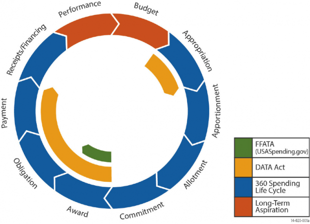
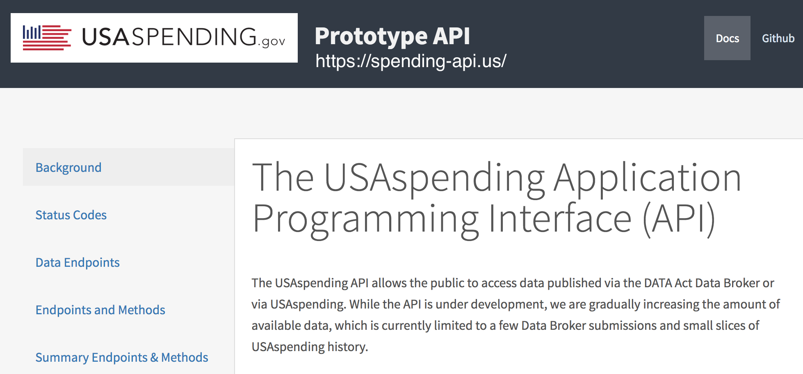
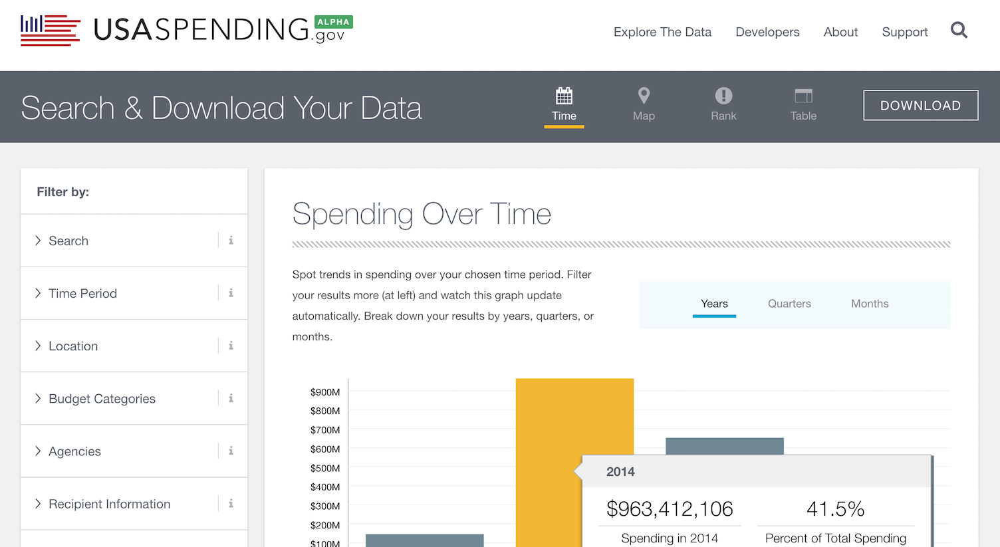

# Federal Spending API Sneak Peak


Becky Sweger  
rebecca.sweger@gsa.gov  
@bendystraw

# $4,000,000,000,000



# Spending Lifecycle as API Endpoints

* **[Accounts](https://spending-api.us/api/v1/accounts/?limit=2)**: Track money related to specific pool of funding allocated by Congress
* **[Awards](https://spending-api.us/api/v1/awards/?limit=2)**: Grants, contracts, payments to individuals, loans
* **[Transactions](https://spending-api.us/api/v1/transactions/?limit=2)**: Spending-related action against a specific award



# Complex Filters

Find awards where the FAIN is NOT NULL where the recipient was located in SD, FL, TX, VA or the awarding agency was the Small Business Administration.

```json
{
    "page": 1,
    "limit": 2,
    "order": ["id"],
    "filters": [
        { 
            "field": "fain",
            "operation": "is_null",
            "value": false
        },
        {
            "combine_method": "OR",
            "filters": [
                {
                    "field": "recipient__location__location_state_code",
                    "operation": "in",
                    "value": ["SD", "FL", "TX", "VA"]
                },
                {
                    "field": "awarding_agency__toptier_agency__name",
                    "operation": "equals",
                    "value": "SMALL BUSINESS ADMINISTRATION"
                }
            ]
        }
        ]
}
```


```python

```

# Aggregate Filters

For transactions of type A, B, C, or D, sum transaction obligated amounts by action date year. Order the result by year.


```json
{
    "field": "federal_action_obligation",
    "group": "action_date",
    "date_part": "year",
    "aggregate": "sum",
    "order": ["item"],
    "filters": [
        { 
            "field": "type",
            "operation": "in",
            "value": ["A", "B", "C", "D"]
        }
     ]
}
```

# https://spending-api.us/



# Help Wanted

* First iteration of new USASpending and API drops in May
* Best time to give feedback is now, while we're building
* [Self-schedule a 30-45 minute session with our research team](https://airtable.com/shr2ZnMomznkSCYho#04): http://bit.ly/2bUh0rC

# Links


* [USAspending API](https://spending-api.us/): Treasury's prototype DATA Act API

* [Federal Spending Transparency Collaboration Space](http://fedspendingtransparency.github.io/): DATA Act and schema information

* [USAspending Open Beta](https://openbeta.usaspending.gov/index.html): USAspending website concepts

* [USAspending Sprint Board](): Current and upcoming work

# Sources

* [Financial Report of the United States Government, Citizens Guide](https://www.fiscal.treasury.gov/fsreports/rpt/finrep/fr/16frusg/CitizensGuide_2016.pdf)
* Federal Spending Lifescyle image via [Fedscoop](https://www.fedscoop.com/the-data-act-make-following-the-money-worth-it/)


# Thank You!

rebecca.sweger@gsa.gov  
@bendystraw
